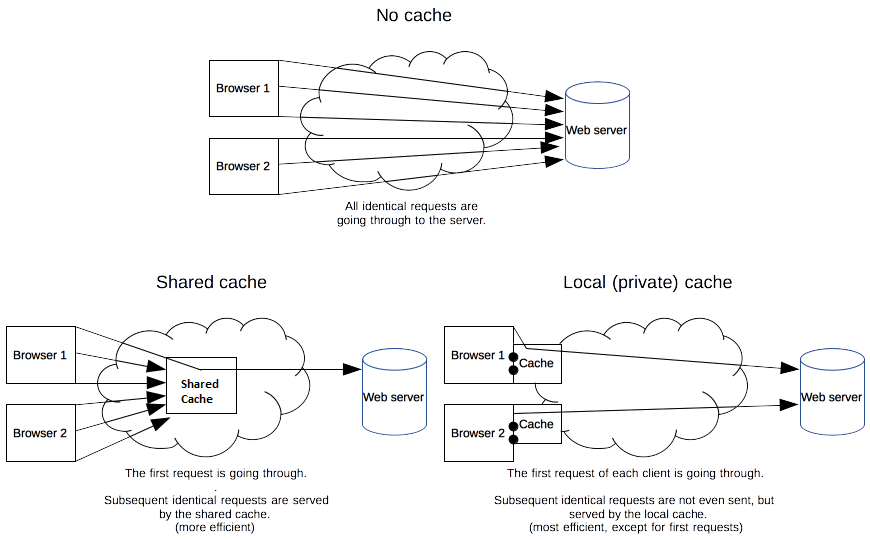
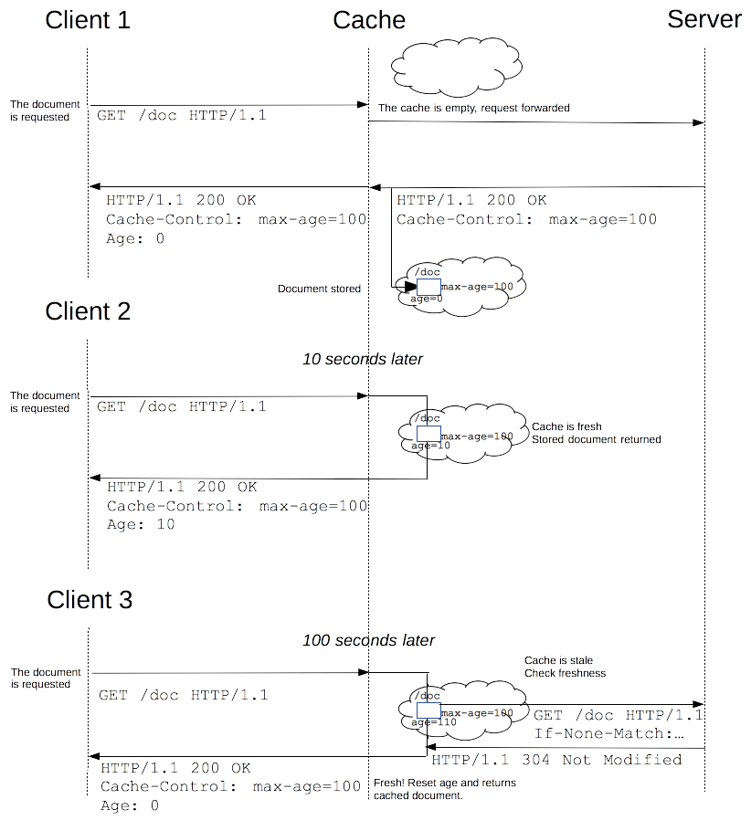

# SSR, CSR, SSGについて

## 概要

1. 前提
2. ゴール
3. 定義
   1. SSR
   2. CSR
   3. SSG
4. 比較
5. リクエスト・レスポンスフロー
6. ボーナス：ISR
   1. リクエスト・レスポンスフロー
7. 質問
8. デモ・クイズ

## 前提

Web開発されている方で、ServerとClientの関係性を理解していること

## ゴール

- SSR, CSR, SSGの違いが理解できた
- 場面によって、相応しい方法を決断を下せるようになった

## 定義

### SSR

Server-side rendering
サーバーサイドレンダリング

HTMLの生成（Rendering）がサーバー側で行なっている

Framework例: Next.js, Nuxt.js, Express.js, Django, Rails等

### CSR

Client-side rendering
クライアントサイドレンダリング

HTMLの生成（Rendering）がクライアント（ブラウザー）側で行なっている

Framework例: React, Vue, Angular等

### SSG

Static site generator
静的サイトジェネレータ

HTMLの生成（Rendering）がビルド時に行い、事前に生成されたHTMLをクライアントに送信する

Framework例: Next.js, Gatsby, Hugo等

## 比較

| 項目 | SSR | CSR | SSG |
| -- | -- | -- | -- |
| レンダリング | サーバー | ブラウザー | なし（pre-rendering） |
| レスポンス速度 | ⏳ | ⏳（初回のみ） | 🏎 |
| 画面遷移速度 | ⏳ | 🏎 | 🏎 |
| デプロイ速度 | 🏎 | 🏎 | ⏳ |
| ユーザー機器負担 | 😀 | 😅 | 😀 |
| SEO | 👍 | 👎 | 👍 |
| レンダー対象 | 個別：リクエスト受信する度 | 個別：ユーザー操作による | 全ページ |
| 描画 | リクエスト毎に全画面 | 変更になる部分のみ | リクエスト毎に全画面 |

## リクエスト・レスポンスフロー

レジェンド

1. 🚢: デプロイ
2. 💻: ユーザー端末
3. ☁: クラウドサーバー
4. 🧑🏻‍💻: 開発・運用

| #  | SSR | CSR | SSG |
| -- | -- | -- | -- |
| 1. | 🚢 | 🚢 | 🧑🏻‍💻 ビルド, データ取得(API/DB等) |
| 2. | 💻 ページリクエスト | 💻 ページリクエスト | 🧑🏻‍💻 HTMLファイル生成 |
| 3. | ☁ リクエスト受信 | ☁ リクエスト受信 | 🚢 |
| 4. | ☁ データ取得(API/DB等) | ☁ 空HTMLレスポンス返却 | 💻 ページリクエスト |
| 5. | ☁ HTML生成(Rendering) | 💻 HTML受信 | ☁ リクエスト受信 |
| 6. | ☁ HTMLレスポンス返却 | 💻 構文解析 | ☁ HTMLファイル返却 |
| 7. | 💻 HTML受信 | 💻 外部リソースリクエスト(CSS/JS/画像/Font等) | 💻 HTML受信 |
| 8. | 💻 構文解析 | 💻 データ取得(API) | 💻 構文解析 |
| 9. | 💻 外部リソースリクエスト(CSS/JS/画像/Font等) | 💻 HTML/DOM生成 | 💻 外部リソースリクエスト(CSS/JS/画像/Font等) |
| 10. | 💻 描画 | 💻 描画 | 💻 描画 |
| 11. | 💻 操作可能 | 💻 操作可能 | 💻 操作可能 |

## ボーナス：ISR

Incremental Static Regenerationといい、レンダリング方法はSSGと同じだが、事前に全ページビルドするではなく、リクエスト受信する度に、リクエスト受けていたページのみビルドされる

大量のページ数があっても、ISR使うことによって、デプロイ時間短縮できて、ユーザーへのパフォーマンスにも影響ほぼなし

### ISRリクエスト・レスポンスフロー

事前ビルドページなしとする（Next.jsでは、一部のページを事前にビルドし、一部のページはリクエスト受けてからビルドすることができる）

#### ページ永遠に更新がない場合

1. 🚢
2. 💻 ページリクエスト
3. ☁ リクエスト受信
4. ☁ ビルド, データ取得(API/DB等)
5. ☁ HTMLファイル生成
6. ☁ HTMLファイル返却
7. 💻 ページリクエスト
8. ☁ リクエスト受信
9. ☁ HTMLファイル返却
10. 🚢
11. 💻 ページリクエスト
12. ☁ リクエスト受信
13. ☁ HTMLファイル返却
14. ...

#### 定期的にページ更新する場合

1. 🚢
2. 💻 ページリクエスト
3. ☁ リクエスト受信
4. ☁ ビルド, データ取得(API/DB等)
5. ☁ HTMLファイル生成
6. ☁ HTMLファイル返却
7. 💻 ページリクエスト
8. ☁ リクエスト受信
9. ☁ HTMLファイル返却
10. ...
11. ⏱ 更新時間経過
12. 💻 ページリクエスト
13. ☁ リクエスト受信
14. ☁ HTMLファイル返却
15. ☁ ビルド, データ取得(API/DB等)
16. ☁ HTMLファイル生成
17. 💻 ページリクエスト
18. ☁ リクエスト受信
19. ☁ HTMLファイル返却
20. ...

実は、SSRでもISRを達成できる

[HTTP キャッシュ](https://developer.mozilla.org/ja/docs/Web/HTTP/Caching) / [Cache-Control](https://developer.mozilla.org/ja/docs/Web/HTTP/Headers/Cache-Control) HTTP ヘッダーを利用することで

1. 🚢
2. 💻 ページリクエスト
3. ☁ リクエスト受信
4. ☁ オリジンサーバーへリクエスト送信
5. 🏢 リクエスト受信
6. 🏢 ビルド, データ取得(API/DB等)
7. 🏢 HTMLファイル生成
8. 🏢 HTMLファイル返却
9. ☁ HTMLファイル返却
10. 💻 ページリクエスト
11. ☁ リクエスト受信
12. ☁ HTMLファイル返却
13. ...
14. ⏱ 更新時間経過
15. 💻 ページリクエスト
16. ☁ リクエスト受信
17. ☁ HTMLファイル返却
18. ☁ ビルド, データ取得(API/DB等)
19. ☁ HTMLファイル生成
20. 💻 ページリクエスト
21. ☁ リクエスト受信
22. ☁ HTMLファイル返却
23. ...

